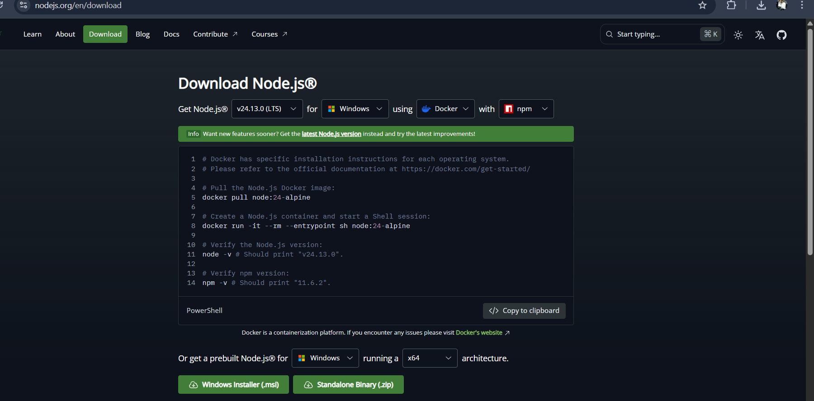

A modern, feature-rich music player built using HTML, CSS and Javascript. This project focuses on delivering smooth UI with powerful features like custom uploads, playlist management, and dynamic UI effects.

FEATURES:

1. Music Playback :
   Play/Pause/Next/Previous controls

   Interactive progress bar

   Display current time and duration

2. Upload your own song :
   Upload MP3 audio file

   Add custom cover images(JPG/PNG)

   Rename songs before adding

   Stored using localStorage

3. Like System :
   Like/unlike songs

   Dedicated liked Songs Section

   Real-time Ui Updates

4. Search :
   Instan search by name

   dynamic filtering

5. Playback Modes :
   Shuufle Mode

   Repeat Mode

6. Playlist system :
   Create custom playlists

   add songs using menu

   prevent duplicate entries

   persistent storage using localstorage

7. Sidebar navigation :
   Toggle siderbar menu

   View All Songs/Liked songs/Playlists

   Smooth scrollable UI

8. Mini Player :
   Sticky bottom mimi player

   Displays current song

   Quick Controls Access

KeyBoard shortcuts

Space = Play / Pause

→ = Next Song

← = Previous Song

M = Mute / Unmute

9. Toast Notifications :
   Smooth notification instead of alerts

   Better UX feedback

10. UI and Exerience :
    Dynamic gradient background based on album art

    Smooth Animations

    Clean Modern Design

TECH STACK :
HTML5, CSS, JavaSript(ES6), FileReader API, LocalStorage API

To run This locally on your machine :

1.Simply install tthe application from the releses the ".exe" file

(if some alert appears just click on more info and the click on Run anyway it's not harmful for your device)

Then it will install automatically

Then you're good to go to use my application

demo video

Why I Made It :
So basically I Love music and I always wanted to make music players SO i gave it a try it does not have all features i've think about but It's nice tho :)

How I made it:

1.Firstly you must need nodejs and npm in your device if not install it according to your needs

2.then run "npm init -y" to intialise the project

3.As it's electron project run "npm install electron --save-dev" to install electron. (You always need to run this command when you are making new elctron project. Run this in your project folder)

4.You're done here with installations now just make files "index.html, styles.css, renderer.js" These are the main file where you write your code

5.also make "main.js" This is very IMP file as this file loads your electrin window ans also initialise it in your "package.json" file

Now you're done just write your codes in main file and there you go you will make your first desktop app using ElectronJS!!
